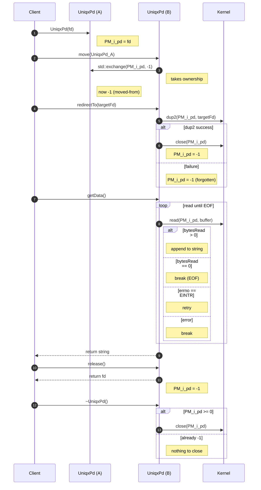

```mermaid
sequenceDiagram
    autonumber

    participant Client
    participant UniqxPd_A as UniqxPd (A)
    participant UniqxPd_B as UniqxPd (B)
    participant Kernel

    %% Construction
    Client->>UniqxPd_A: UniqxPd(fd)
    Note right of UniqxPd_A: PM_i_pd = fd

    %% Move construction
    Client->>UniqxPd_B: move(UniqxPd_A)
    UniqxPd_B->>UniqxPd_A: std::exchange(PM_i_pd, -1)
    Note right of UniqxPd_B: takes ownership
    Note right of UniqxPd_A: now -1 (moved-from)

    %% Redirect
    Client->>UniqxPd_B: redirectTo(targetFd)
    UniqxPd_B->>Kernel: dup2(PM_i_pd, targetFd)
    alt dup2 success
        UniqxPd_B->>Kernel: close(PM_i_pd)
        Note right of UniqxPd_B: PM_i_pd = -1
    else failure
        Note right of UniqxPd_B: PM_i_pd = -1 (forgotten)
    end

    %% eading data
    Client->>UniqxPd_B: getData()
    loop read until EOF
        UniqxPd_B->>Kernel: read(PM_i_pd, buffer)
        alt bytesRead > 0
            Note right of UniqxPd_B: append to string
        else bytesRead == 0
            Note right of UniqxPd_B: break (EOF)
        else errno == EINTR
            Note right of UniqxPd_B: retry
        else error
            Note right of UniqxPd_B: break
        end
    end
    UniqxPd_B-->>Client: return string

    %% Release ownership
    Client->>UniqxPd_B: release()
    UniqxPd_B-->>Client: return fd
    Note right of UniqxPd_B: PM_i_pd = -1

    %% Destructor
    Client->>UniqxPd_B: ~UniqxPd()
    alt PM_i_pd >= 0
        UniqxPd_B->>Kernel: close(PM_i_pd)
    else already -1
        Note right of UniqxPd_B: nothing to close
    end
```
